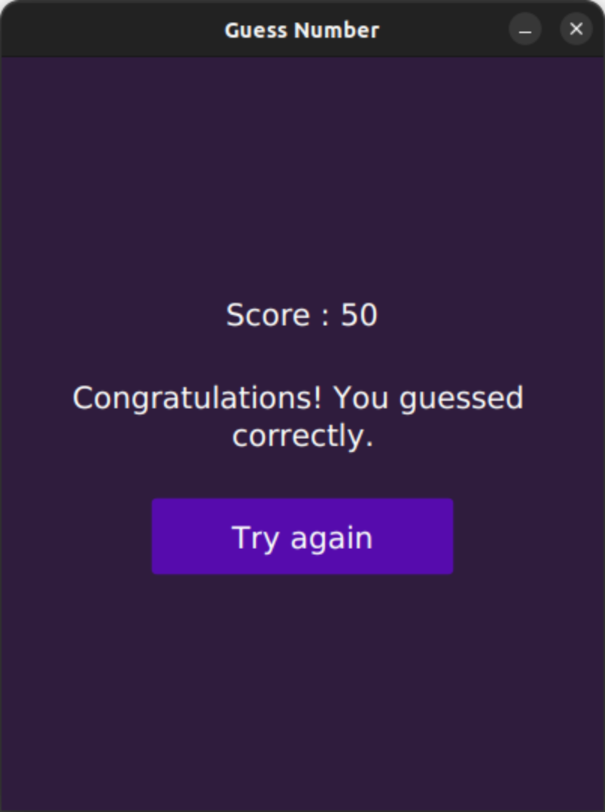
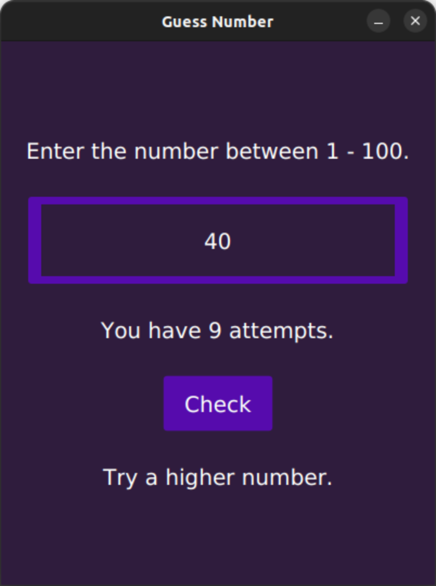
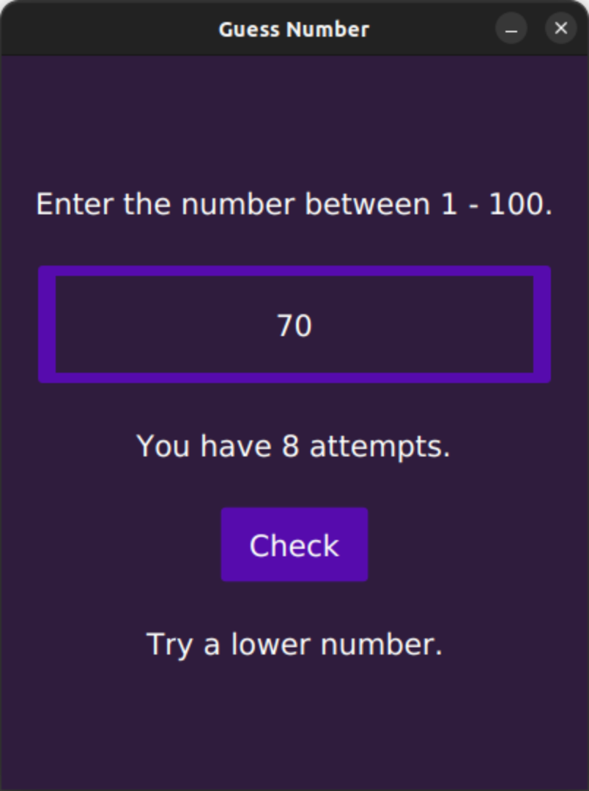

# Number Guessing Game

## Table of contents
- [Features](#features)
- [Screenshot](#screenshot)
- [Demo](#demo)
- [Built with](#built-with)

## Features
- User Interface:  A graphical user interface (GUI) that allows players to interact with the game using buttons, input fields, and displays.
- Random Number Generation: The game generates a random number within a specified range for the player to guess.
- User Input: Players can input their guesses in the GUI.
- Guess Feedback: After each guess, the game provides feedback to the player, indicating whether the guess is correct, too high, or too low.
- Score Tracking: Optionally, the game can keep track of the player's score, such as the number of attempts taken to guess the correct number.
- Play Again: The option to play again after completing or giving up on the current game.

## Screenshot

## Demo
[Demo video](https://github.com/Subashkumar-S/Number_Guessing_Game/assets/112946164/3b885cf3-e70a-4d50-b455-d0d3c5e84661)

## Built with

- Java version [openjdk-20].
- JavaFX
